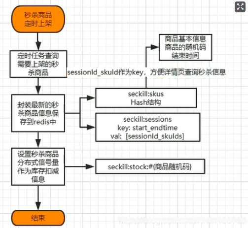

# 秒杀服务
## 定时上架秒杀商品

### 随机码：防止恶意秒杀

为了防止有用户在得知秒杀请求时，发送大量请求对商品进行秒杀，
我们采取了随机码的方式，即每个要参加秒杀的商品，都有一个随机码，
只有通过正常提交请求的流程才可以获取，否则谁都无法得知随机码是多少，
避免了恶意秒杀

### 分布式信号：保存秒杀商品库存量
我们的库存秒杀不应该是实时去数据库扣库存，因为几百万请求进来的时候，如果都去扣，那会直接把数据库压垮。

所以现在秒杀最大的问题就是，如何应对这些高并发的流量

首先，这么大的流量进到服务器的话，肯定有一些流量是无效的，比如秒杀不成功，假设我们现在就一百个商品要被秒杀，哪怕放进来一百万请求，最终也只有一百个请求，能成功的去数据库扣掉库存。

所以我们可以提前在 redis 里边设置一个信号量，这个信号量可以认为是一个自增量，假设这个信号量叫 count，它专门用来计数，它的初始值是 100，每进来一个请求，我们就让这个值减一，如果有用户想要秒杀这个商品，我们先去 redis 里边获取一个信号量，也就是给这一百的库存减一，然后这个值就变成九十九，如果能减成功了，那就把这个请求放行，然后再做后边的处理数据库。如果不能减，那就不用进行后续的操作了，我们只会阻塞很短的时间，就会释放这个请求，我们只有每一个请求都能很快的释放，能很快的做完，我们才能拥有处理大并发的能力。

这块有一个注意点，由于每一个请求进来减这个信号量的值，就是当前商品的库存信息，只有请求里携带了我们给秒杀商品设计的随机码，才可以来减信号量，如果不带随机码的话，直接减信号量的话，就会出现问题，可能秒杀还没开始，有一些恶意请求，就把信号量就减了了。

所以上面说的随机码是一种保护机制。

### 上架商品的幂等性保证
加一个分布式锁，获取到锁的机器才能执行，获取不到锁的机器，可以等获取到锁的机器执行失败，再次获取锁，这样获取到了还可以执行。如果获取到锁的机器已经把这个任务执行完了，那其它机器也就不需要执行了。